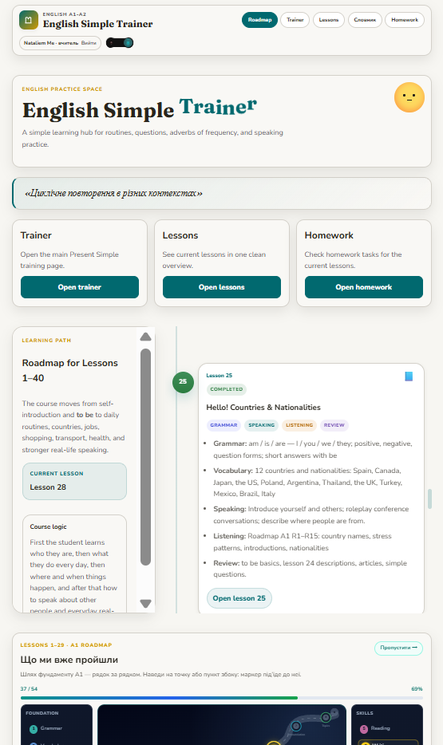

# English Simple Trainer

Personal A1 English teaching SPA for **one-to-one** lessons: roadmap, interactive lessons, vocabulary, quizzes, audio drills, and homework submissions.

Built with **React 19 + Vite 8 + TypeScript**, deployed to **GitHub Pages**.

---

## Interface

The site is a **learning-platform shell**:



*Home is a full **Roadmap** hub — hero, Learning Path with the current lesson, lesson cards with status tags, and “Що ми вже пройшли”.*

- **Home (`/`)** is the **Roadmap**: hero, Learning Path (lessons 1–64), then covered-topics map
- **Desktop** — sticky top bar + nav (Roadmap, Trainer, Lessons, Vocab, Homework) and teacher account controls
- **Mobile** — bottom nav; the long lesson timeline **folds** behind a Roadmap toggle
- **Lessons / Homework** catalogs use **cover cubes** (latest numbered lesson is current; earlier ones are dimmed)
- Lesson pages keep a **contents rail** on wide screens and a “Зміст уроку” drawer on smaller ones
- **Cabinet** lives at `/cabinet` (student / teacher dashboard). `/roadmap` redirects to `/`

No shop / paywall chrome — teal-on-paper teaching UI only.

---

## Features

- **Roadmap** — curriculum overview (lessons 1–64); current class is **Lesson 47 · Skills**
- **Lessons 15–46** — full interactive pages (speaking, vocab, listening, grammar, reading); L36–38 and L43–46 are content-driven
- **Homework** — `/hw-25`…`/hw-47`; older `/homework/:id` still used for early lessons
- **Vocab** — dictionary with IPA + Web Speech pronunciation
- **Trainer** — conjugation + question builder, then 50 core verbs; practice decks and scored quizzes
- **A1 Level Test** — separate check at `/a1-level-test`
- **Extra resources** — infographics / worksheets
- **Self-study / About me** — writing practice saved to Firestore
- **Admin** — teacher view of homework submissions + lesson analyses (Google Sign-In)
- **Theme** — light / dark

Lessons are written for **one student + one teacher**. Classroom phrases such as “Work in pairs” are rewritten for that format.

---

## Current course (interactive)

| Lesson | Topic |
|--------|--------|
| 15–24 | Present Simple, frequency, prepositions, do/make, third person, can, articles, describing people |
| 25–27 | Roadmap A1 Unit 1–2: countries, jobs, family |
| 28–29 | Speaking he/she/it · everyday objects · numbers |
| 30 | Check & Reflect + optional A1 Level Test |
| 31 | Unit 3A · My town (there is/are) · HW crossword |
| 32 | WH-questions · was/were |
| 33 | Unit 3B · Is there wifi? |
| 34 | Unit 3C · It's expensive! + Present continuous |
| 35 | Unit 3D · English in action: directions |
| 36 | Present Simple · daily verbs (ELLLO video) |
| 37 | Present continuous speaking: *I work every day* / *I am working now* |
| 38 | Unit 4A · *You've got a friend* · have/has got |
| 39 | Unit 4B · *Have you got it?* · pack a bag |
| 40 | Unit 4C · Dos and don'ts |
| 41 | Unit 4D · What's the time? |
| 42 | Unit 5A · My week · days · travel |
| 43 | A long journey · Past Simple start (yesterday) |
| 44 | Unit 5C–5D · Food and drink · Order in a café |
| 45 | Unit 6A · Good and bad habits |
| 46 | Unit 6B · Jobs around the house |
| 47 | Unit 6C · Skills **(current)** |

**Next (planned):** 47 Skills (can/can’t) · 48 Make requests · 49–52 places & was/were & tickets · 53–56 Past Simple stories · 57–64 photos, hobbies, goals, going to, invitations

---

## Run locally

```bash
npm install
cp .env.example .env.local   # then fill Firebase values
npm run dev
```

Opens at `http://localhost:5173/` (`vite.config.ts` uses the default base `/`).

---

## Scripts

| Command | Description |
|---------|-------------|
| `npm run dev` | Vite dev server |
| `npm run build` | Typecheck (`tsc -b`) + production build → `dist/` |
| `npm run preview` | Preview the production build |
| `npm run lint` | ESLint |
| `npm run deploy` | **Optional local fallback** — build + `gh-pages` branch (prefer GitHub Actions) |

Live: `https://natalinamatioshko.github.io/english-simple-trainer/`

---

## CI/CD — GitHub Actions → Pages

Production deploys run automatically on every push to **`main`** (workflow: `.github/workflows/deploy.yml`).

### One-time setup

1. **Repo → Settings → Secrets and variables → Actions** — add:

| Secret | Example / notes |
|--------|-----------------|
| `VITE_TEACHER_EMAIL` | teacher Gmail (same as Firestore Rules) |
| `VITE_FIREBASE_API_KEY` | Browser key from Google Cloud Credentials |
| `VITE_FIREBASE_AUTH_DOMAIN` | `english-simple-trainer.firebaseapp.com` |
| `VITE_FIREBASE_PROJECT_ID` | `english-simple-trainer` |
| `VITE_FIREBASE_STORAGE_BUCKET` | `english-simple-trainer.firebasestorage.app` |
| `VITE_FIREBASE_MESSAGING_SENDER_ID` | from Firebase Project settings |
| `VITE_FIREBASE_APP_ID` | from Firebase Project settings |

2. **Settings → Pages → Build and deployment → Source:** choose **GitHub Actions** (not “Deploy from a branch”).

3. Push to `main` (or **Actions → Deploy GitHub Pages → Run workflow**).

4. Open the run → confirm **build** + **deploy** are green. Site URL stays the same project Pages URL.

Vite bakes `VITE_*` into the client at **build time** in CI — same as local. The web `apiKey` will appear in the bundle (expected for Firebase); security = Rules + key restrictions.

---

## Environment variables

```bash
cp .env.example .env.local
```

Fill values from **Firebase Console → Project settings → Your apps** (web app).  
`.env.local` is gitignored — do not commit it.

**Next step if Auth fails (`API_KEY_INVALID`):** Google Cloud Console → APIs & Services → Credentials → create/regenerate a Browser key → paste into `VITE_FIREBASE_API_KEY` in `.env.local` → restart `npm run dev` → test `/admin/submissions`.

| Variable | Purpose |
|----------|---------|
| `VITE_TEACHER_EMAIL` | Teacher email for `/admin/submissions` and student vocab (client UX check only) |
| `VITE_FIREBASE_API_KEY` | Firebase web API key |
| `VITE_FIREBASE_AUTH_DOMAIN` | Auth domain |
| `VITE_FIREBASE_PROJECT_ID` | Project ID |
| `VITE_FIREBASE_STORAGE_BUCKET` | Storage bucket |
| `VITE_FIREBASE_MESSAGING_SENDER_ID` | Messaging sender ID |
| `VITE_FIREBASE_APP_ID` | Web app ID |

If `VITE_TEACHER_EMAIL` is not set, the wrong-account check is skipped; any signed-in Google account may attempt the Firestore read (Rules still deny non-teacher accounts).

Missing Firebase `VITE_*` vars throw a clear error at startup.

**Local deploy fallback:** `npm run deploy` still publishes to the `gh-pages` branch if needed. Prefer the Actions workflow above once Pages Source is set to **GitHub Actions**.

---

## Firebase Console setup (before deploy)

**1. Enable Google Sign-In and Email/Password**

`Firebase Console → Authentication → Sign-in method`

- **Google → Enable** (teacher login; student may also use it)
- **Email/Password → Enable** (student registration + login)

Without Google: `auth/operation-not-allowed` on teacher sign-in.  
Without Email/Password: the student cannot register with email.

**2. Authorize GitHub Pages domain**

`Firebase Console → Authentication → Settings → Authorized domains → Add domain`

Add: `<your-github-username>.github.io`

Without this on the live site: `auth/unauthorized-domain`.  
`localhost` is authorized by default.

**3. Browser API key HTTP referrers (if restricted)**

Google Sign-In popup runs on your Firebase Auth domain, not only on GitHub Pages.  
If the key has Application restrictions → HTTP referrers, include **all** of:

```
http://localhost:5173/*
http://localhost:5174/*
http://127.0.0.1:5173/*
http://127.0.0.1:5174/*
https://natalinamatioshko.github.io/*
https://natalinamatioshko.github.io/english-simple-trainer/*
https://english-simple-trainer.firebaseapp.com/*
https://english-simple-trainer.web.app/*
```

Missing `*.firebaseapp.com` / `*.web.app` often shows: **The requested action is invalid.**

**4. Firestore Rules — teacher review + student vocab**

Keep your real teacher email in Console `isTeacher()`.  
To enable **Mark as reviewed** in `/admin/submissions`, allow teacher updates that only touch `reviewed` + `reviewedAt` (see repo `firestore.rules` → `teacherReviewOnly()`).

To let the student save dictionary words, publish the `studentVocab` rules from the same file: the student can create/read/delete their own words; the teacher can read (and delete) all of them.

Publish after editing.

---

## Project structure

```
src/
  app/            # React Router (App.tsx)
  components/     # Layout shell, practice cards, roadmap, vocab UI, …
  content/        # Content-driven lessons (registry + lesson-XX/)
  context/        # Theme + Auth (email/password + Google)
  data/           # Vocab, verbs, lesson catalog, analyses, HW lists, …
  features/       # Lesson workspace, section renderers, customs
  hooks/          # Quiz / practice hooks
  pages/          # Roadmap home, Cabinet, Lessons, HW, Vocab, Trainer, Admin…
  services/       # Firestore helpers
  styles/         # Global + app shell + per-lesson CSS
  types/          # Shared TypeScript types
  utils/          # App nav, shuffle, text helpers, speech (TTS)
  firebase.ts     # Firebase init (config from VITE_* env)
public/
  images/         # Lesson posters, vocab photos, extras
  sounds/         # Unit audio (Roadmap A1 SB R-tracks) + UI sounds
  videos/         # Local lesson videos (e.g. lesson44/)
```

---

## Firebase

| Collection | Used for |
|------------|----------|
| `homeworkAnswers` | Homework submissions (teacher admin page) |
| `writingSubmissions` | About me / self-study writing saves |
| `studentVocab` | Student-added dictionary words (visible to the teacher on `/vocab`) |

Config is loaded from `VITE_FIREBASE_*` env vars (see `.env.example`). The web `apiKey` is still public in the client bundle after build — that is expected. Security is enforced via **Firestore Security Rules** and API key HTTP referrer restrictions, not by hiding the key in `.env`.

---

## Useful routes

| Path | Page |
|------|------|
| `/` | Roadmap (home) |
| `/cabinet` | Student / teacher cabinet |
| `/lessons` | Lessons catalog |
| `/lessons/43` | A long journey · Past Simple start |
| `/lessons/44` | Food and drink · Order in a café |
| `/lessons/45` | Good and bad habits |
| `/lessons/46` | Jobs around the house |
| `/lessons/47` | Skills |
| `/lesson-42` | My week (Unit 5A) |
| `/hw-42` | Homework · Lesson 42 |
| `/hw-43` | Homework · Lesson 43 |
| `/hw-44` | Homework · Lesson 44 |
| `/hw-45` | Homework · Lesson 45 |
| `/hw-46` | Homework · Lesson 46 |
| `/hw-47` | Homework · Lesson 47 |
| `/admin/analyses` | Teacher: lesson analyses |
| `/admin/analyses/44` | Analysis · Lesson 44 |
| `/a1-level-test` | A1 Level Test |
| `/extra-resources` | Extra infographics |
| `/vocab` | Vocabulary (student words persist after login) |
| `/login` | Student register / login (email + password or Google) |
| `/trainer` | Practice trainer |
| `/homework` | Homework index |
| `/self-study` | Self-study review |
| `/about-me` | About me writing |
| `/admin/submissions` | Teacher: submissions |
